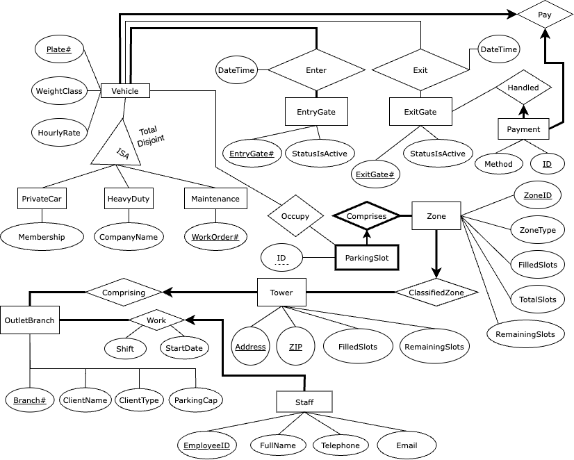

# Car Parking Management System

A repository for CPSC 304: Introduction to Relational Databases by the University of British Columbia. Our objective was design a database with an interactive GUI application.

---

## Group Members and Student Numbers

- (13046024) Dwayne Dmello
- (67719955) Theo Obadiah Teguh
- (49330046) Adeeb Khan

---

## General Description

This project involves the development of a database system tailored for multi-level car parks. This application is designed to streamline the management of parking facilities, providing a solution for overseeing operations, assessing profitability, and analyzing car distribution within a network of parking lots. The primary goal is to enhance efficiency and user experience in parking lots while addressing common challenges such as finding parking spaces in crowded areas, locating parked cars, and planning ahead for reservations.

---

## Database Overview

Our database can explained with the following Entity Relationship Diagram. Please note that the following figure has been **reviewed and updated** over the first two project milestones.

---

## Project Timeline

- 16th March: Plan out exact functionality and rough frontend design.
- 17th March: Start programming frontend with React.js, start designing database queries.
- 23rd March: Have frontend ready, have the database set up and hosted, with queries for all functionalities ready. Crosscheck work to ensure compatibility.
- 24th March: Start developing the Express.js API to link the frontend and backend.
- 31st March: Finish developing API. Have all endpoints tested in postman and well commented for use in frontend. Start calling API from frontend and completing the linking.
- 2nd April: Finish linking the frontend and backend, iron out any last minute bugs or discrepancies.
- 3rd April to 5th April: Ask for feedback in office hours and from TA to improve project and make final changes.
- 5th April: Submit project by 6pm or sooner.

## Change Log
Throughout the process of our implementation, we altered our Entity Relationship Diagram several times. In particular, we introduced some naming changes for some tables. We have updated them such that the new diagram in this milestone is consistent with our code. The name changes are as follows:
Vehicle is now VehicleClass.
Plate# is now PlateNumber.
WorkOrder# is now WorkOrderID.
ID (an attribute of ParkingSlot) is now ParkingSlotID.
ID (an attribute of Payment) is now PaymentID.
ZoneID is now ParkingZoneID.
ZoneType is now ParkingZoneType.
TotalSlots (an attribute in Zone) is now ZoneTotalSlots.
ZIP (an attribute in Tower) is now Zip.
OutletBranch is now BranchClient.
Branch# is now BranchID.

Additionally, we also deleted several attributes. The deletions are as follows:
HourlyRate from VehicleClass. This is because we only have three weight classifications. Instead of having an extra column for the hourly rate for each vehicle entered in our database (and note that we can have a very large number of vehicles), we just create a new reference table (i.e. an entity) called WeightRate which stores only three rates for each type of vehicle.
FilledSlots and RemainingSlots from both Zone and Tower entities. We decided that these would not be stored, as we can easily make a query, rather than creating an increment/decrement system based on entering and exiting vehicles.
ParkingCap from BranchClient. Similar to the previous point, we decided to make this a JOIN query instead.

Finally we added several new parts and changed some constraints, listed below.
Added a TowerID primary key to Tower, and removed Zip and Address from primary key status. This just made more sense, and it made the code more robust and feasible to implement.
Added TowerTotalSlots to the Tower entity. This also made things easier to implement for us. This particularly helps when querying for the count of parking slots in each branch.
Added an Amount attribute to the Pay relationship. This is clearly insightful data for the purpose of our whole system, as we can calculate revenues.
Added ParkingZoneID and ParkingSlotID to Exits. This allowed us to take note of the parking history of each vehicle. Every time a vehicle leaves our facilities, we take record of the zone and slot that they parked in. This functionality was vaguely described in the previous stages of our project, but with this design we managed to create a successful and effective procedure.
Altered the key and participation constraint for the Pay relationship. We changed it to “a many to one”, changed the VehicleClass side to non-total participation, and kept the Payment side to total participation. All vehicles in our VehicleClass table are past/current users of our system. Everytime a vehicle exits our facilities, a Pay record is added. Perhaps some vehicles just entered our parking facility and have not paid. These vehicles will be added to VehicleClass (as they are listed as past/current users), but they won’t show up in Pay yet as they have not exited our facility. Hence the non-total participation. On the other hand, payments must correspond to a singular vehicle, and every vehicle may have more than one payment (they can use our facilities multiple times). Therefore, we have the total participation on the payment side.

## Additional Notes:
We hosted our database on an AWS Cloud Server. We populated table instances via terminal connection. A utility file called sql_login.sh located in the Database folder was used to allow easier login. The database server was then connected with our Node.js backend.

